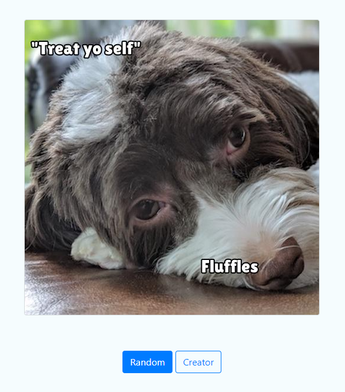
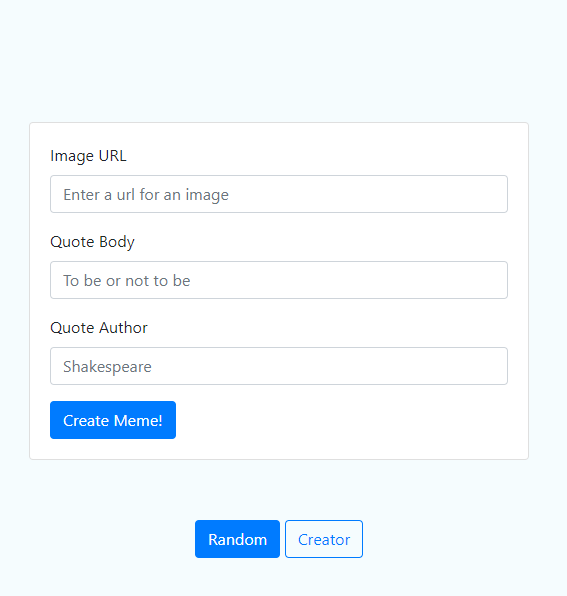
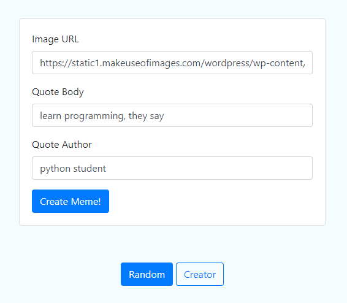

# Meme Generator

### **Description:**

Meme Generator is a program to make random or customized memes. 
Random implementation uses libraries of pictures and quotations (body and author).
Customized implementation takes as arguments url of a picture, body and author as
strings. In both cases body of the quotation and its author are put on the picture.

### **How the programm works:**

Meme generator can be run in two ways: using `app.py` and `meme.py` modules. 
`app.py` module starts the program in a brawser on the website http://127.0.0.1:5000/,
by a command "app.py" in the terminal.

Clicking on a `Random` button, creates a random meme. Clicking on a
`Creator` button, takes a user to a customized meme creator:

Here, a user can enter an url of a picture and quote body and quote author:

Clicking a `Create Meme!` button generates a customized meme:

The other way to do it is `meme.py` module form the terminal level. A user can
start the program by a command "meme.py" and providing three optional arguments:
path - which is a directory name of a jpg file that can be used to make a meme,
body which is a quote and autor. It can be implementad as follow:
`meme.py --path [a directory of a file] --body [body of a quote] --author [name 
of the author]`. Note that it may take a few seconds to make a meme this way. 
If a user needs help just type `meme.py -h`. The path of a picture as well as body 
and author are optional arguments. If they are not provided, the program uses the 
libraries of pictures and quotes. However, if body of a quote is entered, the author 
has to be entered as well!

Created memes are stored on a user's computer. Those created by `app.py` in 
<b>static</b> folder, those created by `meme.py` in <b>tmp</b> folder. 

Enjoy!

